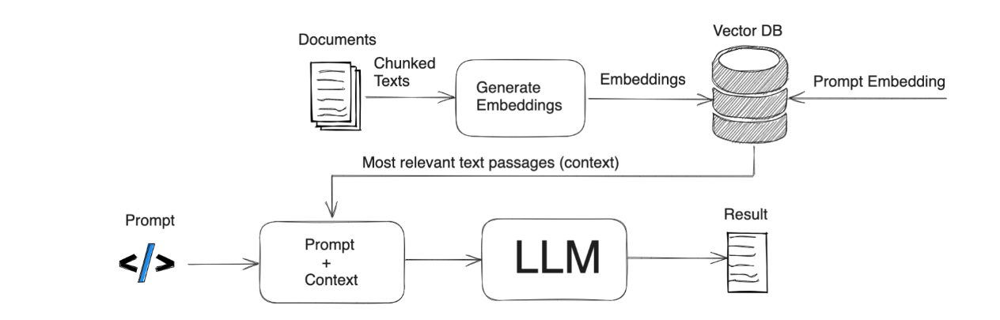

# 📄 Simple RAG Pipeline with Google AI + FAISS

This repository demonstrates a simple implementation of a **Retrieval-Augmented Generation (RAG)** pipeline.

The project loads a PDF document, processes it into smaller chunks, generates embeddings using **Google AI**, and stores those embeddings in a **FAISS vector database**. When a user query is provided, the system retrieves the most relevant chunks from FAISS and passes them to a document chain to generate a context-aware response.

---

## ⚙️ Workflow

<div align="center">

</div><BR>

1. Initialize Google AI model
2. Load PDF document
3. Split the document into smaller chunks
4. Generate embeddings using Google AI
5. Store embeddings in FAISS vector database
6. Create a document retrieval chain
7. Retrieve relevant chunks for a query
8. Generate a response using the retrieved context

---

## 🛠 Tech Stack

* 🤖 Google AI (Embeddings / LLM)
* 📦 FAISS Vector Database
* 🔗 LangChain
* 🐍 Python

---

## 💡 Use Case

This project serves as a **minimal example of building a RAG system** for **document-based question answering**.

---

## 🚀 Run Locally

Download or clone this repository and open the project folder in **VS Code**.

Install the required dependencies:

```bash
pip install -r requirements.txt
```

Create a **`.env`** file in the root directory and add your **Google AI API Key**:

```env
gemini_api_key=your_api_key_here
```

Generate your API key from Google AI Studio:
https://ai.google.dev/gemini-api/docs/api-key

After adding the API key, open the **`.ipynb` notebook file** in VS Code or Jupyter and run the cells.
You will be able to run the file and test the **RAG pipeline** with your queries.

